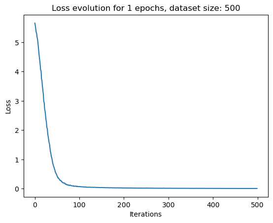

# Mirasol3B - Project report

### Author: YAZID BOUHRIA 2124866

I provide in this project an implementation of the model Mirasol presented in the paper [MIRASOL3B: A MULTIMODAL AUTOREGRESSIVE MODEL FOR TIME-ALIGNED AND CONTEXTUAL MODALITIES](https://arxiv.org/pdf/2311.05698.pdf).

The Mirasol method is an approach for integrating and processing multimodal data, such as audio, video and text, for comprehension and content generation tasks. The implementation focuses on transforming multimodal inputs into latent representations using specific encoders, then combining them via a combination module. Textual context processing is carried out using cross-attention to integrate contextual information. An autoregressive decoder is used to generate predictions based on the combined representations. The aim is to enable the machine to understand and generate content by capturing the nuances of different input modalities.

## Implementation description

The implementation that I propose includes several key components for processing and generating content from multimodal data (audio, video and text):

- `RandomData` generates random data for training.
- `CombinerModel` integrates audio and video representations.
- `AudioExtractor` and `VideoExtractor` extract features from audio and video inputs respectively.
- `ContextAutoregressiveModel` and `TemporalAutoregressiveModel` process textual context and generate predictions respectively.
- `MirasolModel` gather entire process from feature extraction to text generation.

I've deliberately ignored the aspect of segmenting video and audio inputs into timechunks to get my model working on small inputs first.

I thought I'd have time to integrate them later, but that didn't happen because of the difficulties I had implementing this project.

Concerning the dataset, I decided to go on a random generated dataset in order to focus on the neural network building. After that, I tried to implement a Dataset based on samples from the _MSRVTT-QA_ dataset, as suggested in the paper, but my training had some issues with it (mostly because of missing input data segmentation...).

I propose to dive-in the implementation and to explain how components are working

### Datasets

#### RandomDataset

The RandomData class in PyTorch creates a dataset for generating random multimodal data, including audio, video, and textual context, along with random target labels for each instance. It's designed to simulate real-world data for training and testing multimodal machine learning models, providing a customizable number of samples (n). Each sample comprises random tensors representing audio features, video frames, contextual information, and target labels, facilitating the development and testing of models without requiring actual data.

#### CustomVideoDataset

This provide a dataset from the _MSRVTT_ dataset by loading video and audio data. This class extracts and processes video and audio features, including normalizing video inputs and converting audio to a specified sample size. I also converted associated textual information (questions and answers from annotations) into a usable format for the model, such as ASCII tensors, facilitating multimodal learning tasks.

### Mirasol components

#### VideoExtractor

This class is designed to process video data by extracting interesting features using a pretrained neural network: the R3D-18 model from torchvision.models. It modifies the original architecture by removing the final classification layer, making it suitable for feature extraction rather than classification. This allows the extracted features to be used as input to other models of Mirasol that require a condensed representation of video content. I wrote it with the help of ChatGPT.

#### AudioExtractor

This class transforms audio waveforms into Mel Spectrogram representations. This process involves converting the raw audio signal into a set of coefficients that represent the power spectrum of the audio within various Mel scale frequency bands.
The Mel scale is designed to mimic the human ear's response more closely than the linearly-spaced frequency bands used in the standard spectrogram. This makes Mel Spectrograms particularly useful since it captures important audio characteristics in a format that's easier for Mirasol to process and understand.

#### Combiner

As written in the paper, this model aim to integrate and process multi-modal data inputs using a Transformer encoder architecture.
It first projects the concatenated features of different modalities (like audio and video) to to the define model dimension `model_dim` using a linear projection.
This is crucial because it allows for the uniform processing of heterogeneous data types. Then, it applies a series of Transformer encoder layers to these projected inputs. This enables the model to learn complex relationships and interactions between the different modalities, enhancing its ability to generate contextually relevant outputs.\
The use of Transformer architecture here is key for capturing the sequential and relational dynamics in the data, making it a critical component for the multimodal learning capabilities of the Mirasol model.

#### ContextAutoregressiveModel

This is one of the key model in the Mirasol architecture since it integrate sequential, non-aligned context modalities such as text in order to be combined with the time-aligned modalities like video and audio. It employs an embedding layer to convert token IDs into a meaningful representation, which is then processed by a Transformer encoder to capture the sequential nature of the context. As suggested in the paper, there is a cross-attention mechanism that subsequently merges this context with the combined video-audio latent space `combined_latent`, focusing on extracting relevant features. The model utilizes average pooling post cross-attention to distill the sequence into a single representative embedding, which is then passed through a fully connected layer to produce the final output.

#### TemporalAutoregressiveModel

Another key model in the Mirasol architecture which aim to handle time-aligned modalities like audio and video data. It consists of an embedding layer that maps input tokens to high-dimensional vectors, a Transformer decoder that autoregressively processes the embeddings while considering the entire sequence up to the current step, and a fully connected output layer that maps the decoder's output to the vocabulary size, predicting the next token.\
This model is crucial for capturing the temporal dependencies and generating sequences in a manner consistent with the learned patterns from time-synchronized inputs.

### Mirasol model

The MirasolModel integrates all previoyus components to process and generate sequences based on multi-modal inputs (audio, video, and context).\
It process the inputs through its `forward` method:

1. Audio Processing: The audio input is converted into a Mel spectrogram via the AudioExtractor.

2. Video Processing: Concurrently, the video input is passed through the VideoExtractor to obtain video features.

3. Combining Modalities: The extracted audio and video features are concatenated and fed into the CombinerModel to create a unified representation.

4. Context Processing: If context input is provided, it is incorporated using the ContextAutoregressiveModel to enhance the combined representation with contextual information.

5. Sequence Generation: The TemporalAutoregressiveModel uses the enriched latent representation to autoregressively predict the next token in the sequence.

6. Output: The final output is a sequence generated from the model, which integrates audio, video, and context information to make predictions.

The training phase involves iteratively processing batches of multimodal inputs—audio, video, and contextual text—through the model. For each batch, the model extracts features, combines them, processes context, and then predicts the target sequence. The predictions are compared to the actual targets using a **CrossEntropyLoss** function to compute the loss, which is then minimized using the **AdamW** optimizer. This phase refines the model's parameters to better align its predictions with the expected outputs.

After the training there is the generation. The model is set to evaluation mode and a sequence is generated token by token. Starting with an initial token the model predicts subsequent tokens using the combined features of audio and video inputs, enriched by context when available. This autoregressive process continues until an end token is predicted or a maximum sequence length is reached. The outcome is a sequence that mirrors the training target patterns, representing the model's best guess based on learned multimodal relationships.

## Execution and evaluation

### Loss evaluation

\

The loss evolution graph for the model during training shows a promising decline, indicating that the model is learning from the data. Starting at a higher value, the loss decreases significantly over 100 iterations, suggesting that the model's predictions are getting closer to the actual target values with each batch processed. However it was before I saw the model generation.\

### Generation (evaluation)

```
[384.923s] Generation complete
Generated sequence: [0, 0, 0, 0, 0, ..., 0]
Target: tensor([[103, 132, 250,  ...,  92, 174, 227]])
```

\
This phenomen often indicative of an issue with the learning process or data. In the case of using a randomly generated dataset, the model may not be learning meaningful patterns from the data. This is because the random data lacks the inherent structure and correlations present in real-world data, which the model needs to learn to make accurate predictions. Consequently, the model might converge to a trivial solution, such as predicting the most frequent class, which in this case appears to be zero.

### About the VideoQA dataset

In the beginning I underestimated the importance of setting a data segmentation into timechunks, which is important and mentionned in the paper.\
I realized how it was when I wanted to work with real datas such as the _MSRVTT_ dataset. Even if I suceeded having a pseudo-dataset from _MSRVTT_, I had to trim the video frames and audio samples in order to let my computer process the training.\
